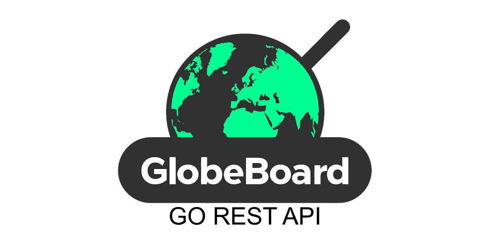

# GlobeBoard Go REST API

## Introduction

[](https://git.gvk.idi.ntnu.no/Nintendo_Alex/globeboard_cicd/-/commits/main)
[](https://git.gvk.idi.ntnu.no/Nintendo_Alex/globeboard_cicd/-/commits/main)
[](https://creativecommons.org/licenses/by-nc-nd/4.0/)

GlobeBoard Go REST API is a webapplication REST API service designed to provide GeoLocational Information.
## Authors
This code was developed by:
- Torgrim Thorsen [@Nintendo_Alex](https://git.gvk.idi.ntnu.no/Nintendo_Alex)
  In collaboration with:
- Robin Jahre [@robinja](https://git.gvk.idi.ntnu.no/Nrobinja)
- Phrot Vedal [@BossTheModern](https://git.gvk.idi.ntnu.no/BossTheModern)
## Features

- User Registration through Firestore Auth
- API Key Access
- GitLab CI/CD Integration
- Docker Compose Containerization
- Discord Webhook Integration

## Tech Stack

### API Implementation
- **Language:** Go

### Deployment
- **Platform:** OpenStack
- **Containerization:** Docker Compose
    - **Description:** Services are containerized using Docker Compose to facilitate easy deployment and scaling.

## API Reference / Documentation

### Register as a user to retrieve an API key:

```http
  POST /util/v1/user/register
```
| Content-Type                        |
|:------------------------------------|
| `application/x-www-form-urlencoded` |

| Key        | Value: Type | Description                 |
|:-----------|:------------|:----------------------------|
| `username` | `string`    | **Required**. Your Username |
| `email`    | `string`    | **Required**. Your Email    |
| `password` | `string`    | **Required**. Your Password |

#### Response:

| Status Code   | Content-Type       |
|:--------------|:-------------------|
| `201 Created` | `application/json` |

```json
{
    "token": "your API key",
    "userid": "your Unique User ID (UUID)"
}
```


### Delete your user profile:

```http
  DELETE /util/v1/user/delete/{ID}
```

| Parameter | Type     | Description             |
|:----------|:---------|:------------------------|
| `ID`      | `string` | **Required**. Your UUID |

#### Response:

| Status Code | `204 No Content` |
|:------------|:-----------------|

### Get a New API key: (Old must be deleted first, only allowed one)

```http
  GET /util/v1/key/
```

| Authorization | `Your UUID` |
|:--------------|:------------|

#### Response:

| Status Code   | Content-Type       |
|:--------------|:-------------------|
| `201 Created` | `application/json` |

```json
{
    "token": "your new API key"
}
```

### Delete your API key:

```http
  DELETE /util/v1/key/?token={token}
```
| Authorization | `Your UUID` |
|:--------------|:------------|

| Parameter | Type     | Description                               |
|:----------|:---------|:------------------------------------------|
| `token`   | `string` | **Required**. Your API key, to be deleted |

#### Response:

| Status Code | `204 No Content` |
|:------------|:-----------------|

### Check API Statuses: (Firestore, independent third party API, Version, Uptime)

```http
  GET /dashboards/v1/status?token={token}
```

| Parameter | Type     | Description                |
|:----------|:---------|:---------------------------|
| `token`   | `string` | **Required**. Your API key |

#### Response:

| Status Code  | Content-Type       |
|:-------------|:-------------------|
| `200 OK`     | `application/json` |

```json
{
    "countries_api": "Status of the REST Countries API",
    "meteo_api": "Status of the Open-Meteo API",
    "currency_api": "Status of the REST Currency API",
    "firebase_db": "Status of your Firestore Database",
    "webhooks": "Number of webhooks tied to your user",
    "version": "API Version",
    "uptime": "Time since last server reboot (In Seconds)"
}
```

### Register a Country to get information for:

```http
  POST /dashboards/v1/registrations?token={token}
```

| Parameter | Type     | Description                |
|:----------|:---------|:---------------------------|
| `token`   | `string` | **Required**. Your API key |

##### Example POST-Body:
```json
{
   //The Name of the Country Can be omitted if "isocode" is provided. Case-Insensitive
   "country": "Norway",
   //Isocode for the Country Can be omitted if "country" is provided. Case-Insensitive                                    
   "isoCode": "NO",
   // Map of Features to include when querying the dashboard endpoint,
   // features to not include can be omitted
   "features": { 
                  "temperature": true,
                  "precipitation": true,
                  "capital": true,
                  "coordinates": true,
                  "population": true,
                  "area": true,
                  // List of currencies to retrieve the exchange rate for relative to local currency, NOK in this case. Case-Insensitive
                  "targetCurrencies": ["JPY", "usd", "EUR"]
               }
}
```
#### Example of minimal allowed POST Body:
```json
{
   "isocode": "us",
   "features": { 
                  "temperature": true,
                  "targetCurrencies": ["NOK"]
               }
}
```

#### Response:

| Status Code   | Content-Type       |
|:--------------|:-------------------|
| `201 Created` | `application/json` |

```json
{
  "id":         "The registration's ID",
  "lastChange": "Firestore timestamp indicating creation (RFC3339 Format)",
}

```

### Retrieve all registered countries:

```http
  GET /dashboards/v1/registrations?token={token}
```

| Parameter | Type     | Description                |
|:----------|:---------|:---------------------------|
| `token`   | `string` | **Required**. Your API key |


#### Response:

| Status Code  | Content-Type       |
|:-------------|:-------------------|
| `200 OK`     | `application/json` |

##### Example Response Body:
```json
[
    {
        "id": "4SiQmF4Vo6wyq2yW",
        "country": "United States",
        "isoCode": "US",
        "features": {
            "temperature": true,
            "precipitation": false,
            "capital": false,
            "coordinates": false,
            "population": false,
            "area": false,
            "targetCurrencies": [
                "NOK"
            ]
        },
        "lastchange": "2024-04-18T22:21:54.105Z"
    },
    {
        "id": "29dr0SFCfv6fyabb",
        "country": "Norway",
        "isoCode": "NO",
        "features": {
            "temperature": true,
            "precipitation": true,
            "capital": true,
            "coordinates": true,
            "population": true,
            "area": true,
            "targetCurrencies": [
                "JPY",
                "USD",
                "EUR"
            ]
        },
        "lastchange": "2024-04-18T22:19:48.651Z"
    },
    ...
]
```

### Retrieve a specific registration:

```http
  GET /dashboards/v1/registrations/{ID}?token={token}
```

| Parameter | Type     | Description                       |
|:----------|:---------|:----------------------------------|
| `ID`      | `string` | **Required**. The Registration ID |
| `token`   | `string` | **Required**. Your API key        |


#### Response:

| Status Code  | Content-Type       |
|:-------------|:-------------------|
| `200 OK`     | `application/json` |

##### Example Response Body:
```json
{
    "id": "4SiQmF4Vo6wyq2yW", // The Requested ID
    "country": "United States",
    "isoCode": "US",
    "features": {
        "temperature": true,
        "precipitation": false,
        "capital": false,
        "coordinates": false,
        "population": false,
        "area": false,
        "targetCurrencies": [
            "NOK"
        ]
    },
    "lastchange": "2024-04-18T22:21:54.105Z"
}
```

### Update a specific registration:

```http
  PATCH /dashboards/v1/registrations/{ID}?token={token}
```

| Parameter | Type     | Description                       |
|:----------|:---------|:----------------------------------|
| `ID`      | `string` | **Required**. The Registration ID |
| `token`   | `string` | **Required**. Your API key        |

Specify features to update, Country/Isocode cannot be updated;
every feature is not allowed to be false, at least one feature must be true.

##### Example POST-Body:
```json
{
    "features": {
        "temperature": true,
        "capital": true,
        "coordinates": true,
        "targetCurrencies": ["NOK", "EUR"]
    }
}
```

#### Response:

| Status Code    | Content-Type       |
|:---------------|:-------------------|
| `202 Accepted` | `application/json` |

```json
{
    "lastChange": "Updated Server timestamp indicating successful update"
}
```

### Delete a specific registration:

```http
  DELETE /dashboards/v1/registrations/{ID}?token={token}
```

| Parameter | Type     | Description                       |
|:----------|:---------|:----------------------------------|
| `ID`      | `string` | **Required**. The Registration ID |
| `token`   | `string` | **Required**. Your API key        |

#### Response:

| Status Code   | `204 No Content`   |
|:--------------|:-------------------|

### Retrieve a populated specific registration:

```http
  GET /dashboards/v1/dashboard/{ID}?token={token}
```

| Parameter | Type     | Description                       |
|:----------|:---------|:----------------------------------|
| `ID`      | `string` | **Required**. The Registration ID |
| `token`   | `string` | **Required**. Your API key        |

#### Response:

| Status Code    | Content-Type       |
|:---------------|:-------------------|
| `200 OK`       | `application/json` |

##### Example Response Body:
```json
{
    "id": "29dr0SFCfv6fyabb",
    "country": "Norway",
    "iso_code": "NO",
    "features": {
        "temperature": "-5.4",
        "precipitation": "0.00",
        "capital": "Oslo",
        "coordinates": {
            "latitude": "62.00000",
            "longitude": "62.00000"
        },
        "population": 5379475,
        "area": "323802.0",
        "targetCurrencies": {
            "EUR": 0.085272,
            "JPY": 14.04044,
            "USD": 0.090918
        }
    },
    "lastRetrieval": "2024-04-18T23:43:04.501Z"
}
```
#### Example minimal Response Body: (Registration with only temperature)
```json
{
    "id": "29dr0SFCfv6fyabb",
    "country": "Norway",
    "iso_code": "NO",
    "features": {
        "temperature": "-5.2"
    },
    "lastRetrieval": "2024-04-19T00:01:39.642Z"
}
```

### Register a Webhook:

```http
  POST /dashboards/v1/notifications?token={token}
```

| Parameter | Type     | Description                |
|:----------|:---------|:---------------------------|
| `token`   | `string` | **Required**. Your API key |

##### Example POST-Body:
```json
{
   "url": "Where to send the webhook payload", //Discord, webhook.site, etc...
   "country": "isocode for the country the webhook applies to, leave empty for all.",
   "event": ["List of events the webhook applies to."]
}
```
##### List of Webhook Events:
| Event      | Description                            |
|:-----------|:---------------------------------------|
| `INVOKE`   | Envoke Webhook on retrival events.     |
| `REGISTER` | Envoke Webhook on registration events. |
| `CHANGE`   | Envoke Webhook on update events.       |
| `DELETE`   | Envoke Webhook on deletion events.     |

#### Response:

| Status Code    | Content-Type       |
|:---------------|:-------------------|
| `201 Created`  | `application/json` |

##### Example Response Body:
```json
{
  "id": "Webhook ID"
}
```

### Retrieve all Webhooks:

```http
  GET /dashboards/v1/notifications?token={token}
```

| Parameter | Type     | Description                |
|:----------|:---------|:---------------------------|
| `token`   | `string` | **Required**. Your API key |

#### Response:

| Status Code    | Content-Type       |
|:---------------|:-------------------|
| `200 OK`       | `application/json` |

##### Example Response Body:
```json
[
    {
        "id": "J0Y5k6KCuRpPKC8n",
        "url": "https://discord.com/api/webhooks",
        "event": [
            "INVOKE",
            "REGISTER",
            "CHANGE",
            "DELETE"
        ]
    },
    {
        "id": "FfbtRI0kEcRVus3D",
        "url": "https://webhook.site/",
        "country": "NO",
        "event": [
            "INVOKE"
        ]
    }
]
```

### Retrieve specific Webhook:

```http
  GET /dashboards/v1/notifications/{ID}?token={token}
```

| Parameter | Type     | Description                  |
|:----------|:---------|:-----------------------------|
| `ID`      | `string` | **Required**. The Webhook ID |
| `token`   | `string` | **Required**. Your API key   |

#### Response:

| Status Code    | Content-Type       |
|:---------------|:-------------------|
| `200 OK`       | `application/json` |

##### Example Response Body:
```json
{
    "id": "FfbtRI0kEcRVus3D",
    "url": "https://webhook.site/",
    "country": "NO",
    "event": [
        "INVOKE"
    ]
}
```

### Delete a Webhook:

```http
  DELETE /dashboards/v1/notifications/{ID}?token={token}
```

| Parameter | Type     | Description                  |
|:----------|:---------|:-----------------------------|
| `ID`      | `string` | **Required**. The Webhook ID |
| `token`   | `string` | **Required**. Your API key   |

#### Response:

| Status Code   | `204 No Content`   |
|:--------------|:-------------------|

## Environment Variables

To run this project, you will need to add the following environment variables to your .env file, or project environment.

`PORT` - Port to run the project on.

`FIREBASE_CREDENTIALS_FILE` - Path to your Firebase credentials file.

## Run Locally

- Clone the repository

```bash
  git clone git@git.gvk.idi.ntnu.no:course/prog2005/prog2005-2024-workspace/nintendo_alex/globeboard.git
```

- Navigate to the project directory:

```bash
cd globeboard/Go/
```
- ### Run using Go:
  ```bash
  go run ./cmd/globeboard/app.go
  ```
    - From Build:
  ```bash
  go build -a -o app ./cmd/globeboard
  ```
  ```bash
  ./app
  ```

- ### Run using Docker:
  ```bash
  docker compose build
  ```
    - #### Attached—Command line remains connected:
      ```bash
      docker compose up globeboard
      ```

    - #### Detached—Start the container in the background:
      ```bash
      docker compose up globeboard -d
      ```

    - #### View Logs:
      ```bash
      docker compose logs globeboard
      ```

    - #### Follow Logs:
      ```bash
      docker compose logs globeboard -f
      ```

    - #### Stop Services:
      ```bash
      docker compose down globeboard
      ```

## Running Tests

To run tests, navigate to the project directory:

```bash
cd globeboard/Go/
```
- ### Run test using Go:
  ```bash
  go test ./cmd/globeboard
  ```
    - From Build:
  ```bash
  go test -c -o test ./cmd/globeboard
  ```
  ```bash
  ./app
  ```
    - With Coverage using Go: (Full Project)
  ```bash
  go test -cover -coverpkg=./... ./cmd/globeboar
  ```
    - With Coverage from Build:
  ```bash
  go test -c -cover -coverpkg=./... -o test ./cmd/globeboard
  ```
  ```bash
  ./test
  ```

- ### Run test in Docker:
  ```bash
  docker compose build
  ```
    - #### Attached—Command line remains connected:
      ```bash
      docker compose up globeboard-test
      ```

    - #### Detached—Start the container in the background:
      ```bash
      docker compose up globeboard-test -d
      ```

    - #### View Logs:
      ```bash
      docker compose logs globeboard-test
      ```

    - #### Follow Logs:
      ```bash
      docker compose logs globeboard-test -f
      ```

    - #### Stop Services:
      ```bash
      docker compose down globeboard-test
      ```


## Contributing

Contributions to the GlobeBoard REST API are welcome! To contribute, follow these steps:

- Fork the repository.
- Clone your forked repository to your local machine.
- Create a new branch for your changes.
- Make your changes and commit them with clear and concise messages.
- Push your changes to your forked repository.
- Submit a pull request to the original repository, explaining your changes and their significance.

Please adhere to the project's code of conduct and contribution guidelines provided in the [`./CODE_OF_CONDUCT.md`](CODE_OF_CONDUCT.md) and [`./CONTRIBUTING.md`](CONTRIBUTING.md) files, respectively.


## Support

For support, email `torgrilt@stud.ntnu.no` or `torgrim.l.thorsen@gmail.com`.

## License
This project is licensed under:
[](https://creativecommons.org/licenses/by-nc-nd/4.0/)

You are free to download and use this code for educational, personal learning, or non-commercial purposes.
And while we encourage these uses, please note that using this project for commercial distribution,
sales, or any form of monetization is not permitted.